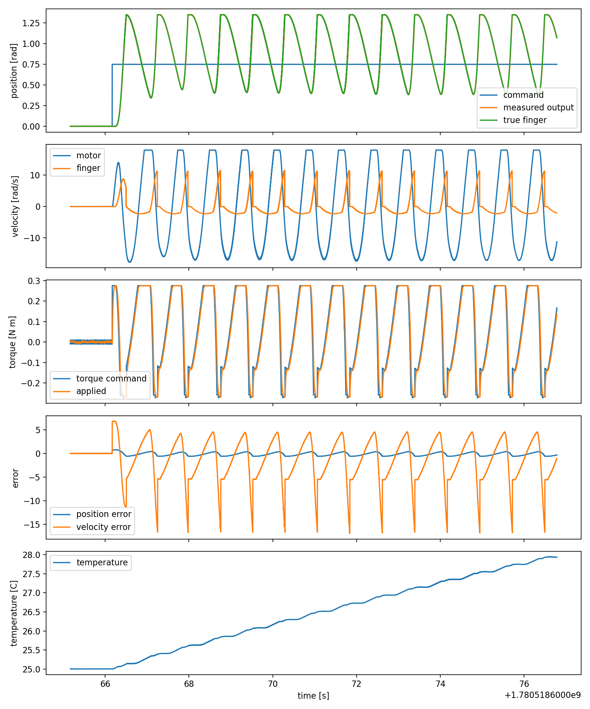

# Tendon Finger Testbench

Simulation-first ROS 2 Humble workspace for actuator characterization and
control of a simplified tendon-driven robotic finger.

This project is a compact bring-up lab for the kinds of problems that show up
when a motor, pulley, cable, encoder, controller, and compliant finger all meet
each other: friction, backlash, tendon slack, stiffness, delay, saturation,
thermal limits, noisy sensors, and closed-loop tuning.

The first pass is intentionally Python-first and readable. The plant model is
implemented in Python for clarity, while MuJoCo provides a visual physics scene
with a base, motor/spool, cable path, and single revolute finger link. The
architecture is meant to make the simulated plant replaceable later with a real
motor driver and encoder hardware interface.

## What You Can Do With It

- Run a simulated tendon-driven finger with motor-side and output-side sensing.
- Tune cascaded position, velocity, and torque/current control loops.
- Compare true state, motor encoder state, and optional output sensor state.
- Inject backlash, slack, tendon stiffness, damping, load torque, noise, and
  command/measurement delay.
- Run automated step, reversal/backlash, friction, sine/chirp, load, and thermal
  tests.
- Log ROS topics to CSV and generate plots plus Markdown reports.
- Use the project as a stepping stone toward `ros2_control` and real hardware.

## Repository Layout

```text
tendon_finger_testbench_ws/
  README.md
  data/
    *.csv, *.png, *.md          generated example test results
  src/tendon_finger_testbench/
    README.md                   package-level details
    config/default_params.yaml  model, controller, sensor, safety, test params
    launch/sim.launch.py        main simulation launch file
    mujoco/tendon_finger.xml    MuJoCo visual/physics model
    tendon_finger_testbench/
      model.py                  plant dynamics and PID helpers
      plant_sim_node.py         simulated plant ROS node
      controller_node.py        cascaded controller ROS node
      command_cli_node.py       simple terminal command interface
      test_executor_node.py     automated test profiles
      data_logger_node.py       CSV logger
      analysis/                 plotting and identification scripts
```

## System Architecture

```text
             /finger/command_position
             /finger/command_velocity
                       |
                       v
          +-------------------------+
          | cascaded controller     |
          | position -> velocity    |
          | velocity -> torque      |
          +-----------+-------------+
                      |
                      | /finger/command_torque
                      v
          +-------------------------+
          | Python plant model      |
          | motor/spool/tendon      |
          | finger/sensors/safety   |
          +-----------+-------------+
                      |
       +--------------+---------------+
       |                              |
       v                              v
 /finger/true_state           /finger/sensor_state
 /finger/safety_status        /finger/motor_encoder
                              /finger/output_sensor
```

MuJoCo is loaded by `plant_sim_node` when available. In this first pass, the
Python plant is authoritative for tendon transmission, backlash, slack, thermal
state, sensor effects, and safety limits. MuJoCo is used for the model scene and
viewer, and can be expanded later for deeper physics coupling.

## Dynamics Model

The plant is built around the familiar single-axis form:

```text
J*q_ddot + b*q_dot + tau_c*sgn(q_dot) + k*q
    = tau_motor_effective - tau_load
```

The model splits this idea across the motor side and finger side:

- Motor side: inertia, viscous damping, Coulomb friction, static friction,
  torque constant, current/torque saturation, actuator lag, and optional
  stiffness.
- Transmission: motor angle maps to spool angle using `gear_ratio`; spool angle
  maps to tendon displacement through `spool_radius`.
- Tendon: tendon stretch is created only after slack is taken up, then cable
  tension is computed from tendon stiffness and damping.
- Finger side: link inertia, damping, Coulomb/static friction, joint stiffness,
  gravity torque, external load torque, and hard stops.

Tendon displacement mapping:

```text
spool_angle = motor_angle / gear_ratio
tendon_drive_displacement = spool_angle * spool_radius
finger_tendon_displacement = finger_angle * tendon_moment_arm
stretch = tendon_drive_displacement - finger_tendon_displacement - slack
tension = max(0, stiffness*stretch + damping*stretch_rate)
```

Output-side backlash can be configured in millimeters and is converted to an
angular deadband using the finger length:

```text
output_backlash_rad = output_deadband_mm * 0.001 / finger_length_m
```

## Requirements

Target platform:

- Ubuntu 22.04
- ROS 2 Humble
- Python 3.10

Optional Python packages:

- `mujoco` for loading the MuJoCo model and launching the viewer
- `matplotlib` for offline plots

## Quick Start

From the workspace root:

```bash
source /opt/ros/humble/setup.bash
pip install -r src/tendon_finger_testbench/requirements.txt
colcon build --symlink-install
source install/setup.bash
```

Launch the simulation headless:

```bash
ros2 launch tendon_finger_testbench sim.launch.py
```

Launch with the MuJoCo viewer:

```bash
ros2 launch tendon_finger_testbench sim.launch.py mujoco_viewer:=true
```

Launch with the command-line interface:

```bash
ros2 launch tendon_finger_testbench sim.launch.py use_cli:=true
```

Send a position command from another terminal:

```bash
source install/setup.bash
ros2 topic pub --once /finger/command_position std_msgs/msg/Float64 "{data: 0.75}"
```

## Command CLI

When launched with `use_cli:=true`, the terminal accepts quick commands:

```text
pos 0.8       command finger angle in radians
posdeg 45    command finger angle in degrees
motor 1.2    command equivalent motor angle in radians
motordeg 90  command equivalent motor angle in degrees
tip 25       command approximate fingertip displacement in millimeters
vel 0.0      set velocity feedforward/setpoint
load 0.05    apply external load torque in N m
reset        reset the simulated plant
```

## Automated Tests

Run a step response test:

```bash
ros2 launch tendon_finger_testbench sim.launch.py \
  use_test_executor:=true \
  auto_start_test:=true \
  test_mode:=step
```

Run with the viewer open:

```bash
ros2 launch tendon_finger_testbench sim.launch.py \
  mujoco_viewer:=true \
  use_test_executor:=true \
  auto_start_test:=true \
  test_mode:=backlash
```

Available test modes:

```text
step       target-angle step response
backlash   positive/negative reversals for deadband estimation
friction   slow sweep for Coulomb and viscous friction fitting
sine       sinusoidal trajectory tracking
chirp      swept-frequency trajectory tracking
load       tracking under external load torque
thermal    repeated duty-cycle motion with current-squared heating
```

The logger is enabled by default and writes timestamped CSV files to `data/`.

## Example Results

The repository includes example logs, reports, and plots generated from the
initial simulation runs.

Step response:




Example report generation:

```bash
ros2 run tendon_finger_testbench generate_summary_report \
  data/testbench_1780518665151713785.csv
```

Other analysis tools:

```bash
ros2 run tendon_finger_testbench plot_test data/testbench_1780518665151713785.csv
ros2 run tendon_finger_testbench step_response_metrics data/testbench_1780518665151713785.csv
ros2 run tendon_finger_testbench backlash_analysis data/testbench_1780518689950319684.csv
ros2 run tendon_finger_testbench friction_fit data/testbench_1780518715344103413.csv
```

## ROS Topics

- `/finger/command_position` (`std_msgs/Float64`)
- `/finger/command_velocity` (`std_msgs/Float64`)
- `/finger/command_torque` (`std_msgs/Float64`)
- `/finger/controller_state` (`sensor_msgs/JointState`)
- `/finger/true_state` (`sensor_msgs/JointState`)
- `/finger/sensor_state` (`sensor_msgs/JointState`)
- `/finger/motor_encoder` (`std_msgs/Float64`)
- `/finger/output_sensor` (`std_msgs/Float64`)
- `/finger/test_command` (`std_msgs/String`, JSON payload)
- `/finger/safety_status` (`diagnostic_msgs/DiagnosticArray`)

## Parameters

Most of the useful knobs live in:

```text
src/tendon_finger_testbench/config/default_params.yaml
```

Good parameters to tune live:

- `controller_node.position.*`
- `controller_node.velocity.*`
- `plant_sim_node.tendon.stiffness_n_per_m`
- `plant_sim_node.tendon.damping_n_s_per_m`
- `plant_sim_node.backlash.*`
- `plant_sim_node.sensors.*noise*`
- `plant_sim_node.delay.*`
- `plant_sim_node.load.external_torque`
- `plant_sim_node.safety.max_current_a`

Example live tuning:

```bash
ros2 param set /controller_node position.kp 12.0
ros2 param set /plant_sim_node backlash.motor_deadband_rad 0.04
ros2 param set /plant_sim_node tendon.stiffness_n_per_m 1200.0
```

Restart is recommended after changing update rates, MuJoCo viewer settings,
major inertial values, or model topology.

## Safety Behavior

The plant clamps or reports:

- current and torque saturation
- max velocity
- joint hard stops
- temperature limit
- invalid command values
- NaN or unstable simulation state

Safety status is published on `/finger/safety_status`.

## Known Limitations

- The tendon model is transparent and tunable, not a detailed cable contact
  solver.
- The MuJoCo model is currently used for visualization/scene loading while the
  Python plant owns the actuator dynamics.
- Standard ROS messages are used to keep the first pass simple, so named
  `JointState` fields carry several scalar diagnostics.
- Direct torque mode and closed-loop mode both publish/consume
  `/finger/command_torque`; avoid running multiple torque command sources at the
  same time during open-loop tests.
- The analysis scripts provide first-pass estimates for learning and comparison,
  not final-grade system identification.

## Future Work

- Add a `ros2_control` hardware interface for real motor driver and encoder IO.
- Add custom messages once the state schema stabilizes.
- Move more rigid-body and actuator coupling into MuJoCo.
- Add encoder zeroing, tendon pretension, and joint-limit calibration routines.
- Extend the model to multi-link fingers and coupled tendon routing.
- Add richer frequency-response analysis for sine and chirp tests.

